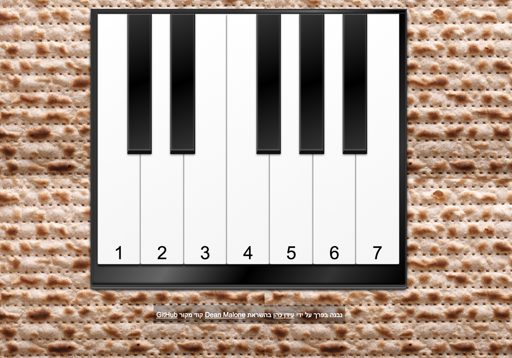
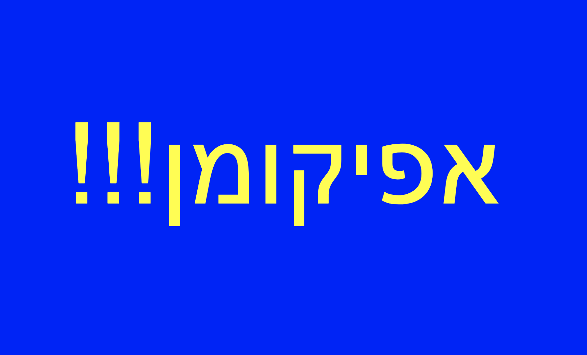

# חידה מוזיקלית לפסח

Based on the wonderful [Piano Play.](http://deanmalone.net/PianoPlay)

## הרעיון

כדי להוסיף קצת עניין לחיפוש אחר האפיקומן, בניתי את החידה המוזיקלית הזו שמתאימה לילדים בכל גיל ומאפשרת המון מקום ליצירתיות והתאמה אישית.

החידה מתחילה כך -

לאחר שמצליחים לנגן את השיר ״שמחה רבה״ מופיע המסך הבא -

## הפיתרון 

רצף התווים הנכון שמוביל לפתרון הוא (משמאל לימין) -

1 4 4 5 3 4 3 2 1

1 2 2 3 1 4 6 5

## החידה 

זה המקום שלכם להיות יצירתיים. אתם יכולים לגלות את הפיתרון לילדים בשלל דרכים ואופנים לפי רמתם. הנה כמה רעיונות -

1. ניתן להחביא ברחבי הבית פתקים ועליהם רצף התווים הנכון. רק תוודאו שאם אתם מחביאים יותר מפתק אחד, חשוב למספר אותם כדי שהסדר ישמר
2. רצץ התווים יכול להיות מוסתר בכתב סתרים, למשל גימטריה או ספרות עבריות עתיקות
3. ניתן לתת לכל אחד מבאי הסדר חלק קטן מרצף התווים, ועל הילדים מוטל לשכנע את האורחים לתת להם את הרצף. על הילדים יצטרכו גם להבין באיזה סדר יש לנגן את התווים, והוא יכול להקבע לפי גיל האורחים, שמם בסדר אלפביתי, מקום הישיבה שלהם, וכו׳
4. ניתן לכתוב רצף של חידות חשבון שפתרונן הוא רצף התווים
